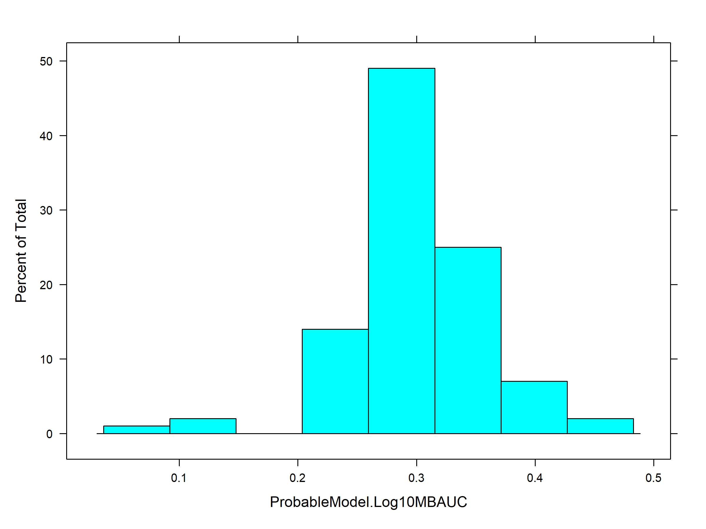

 

# discountingtools

The *discountingtools* R package was designed to support researchers in conducting delay discounting analyses. This approach and methodology features considerable variability and this package has been designed for use as a modular toolkit for approaching questions related to delay discounting. For example, this package can be used to evaluate individual, specific models (e.g., hyperbolic model), explore and compare competing models (e.g., cross-model questions), or simply as a tool to characterize data (e.g., systematic vs. non-systematic responding). Specific features and usage scenarios are illustrated in the sections below.

## Version

Current Version: 0.0.3.2 (beta)

0.0.3.2 - Add in group-pooled analytical strategy

0.0.3.1 - Expanded plotting functionality, helper methods

0.0.3.0 - Documentation and README overhaul, visualizations and simulations improved

0.0.2.1 - Updates to core examples, readme, visualizations

0.0.2.0 - Rebase, now workflow and figures added

## Installation (pre-CRAN state)

1)  Install and load the devtools package. 2) Install and load the digest package. 3) Run install_github to install the package.

``` r
install.packages("devtools")
install.packages("digest")

devtools::install_github("miyamot0/discountingtools")

library(discountingtools)
```

## Model Candidates

-   Noise Model: Intercept-only comparison model (included by default)

-   Exponential Model: Samuelson, P. A. (1937). A note on measurement of utility. The Review of Economic Studies, 4(2), 155--161. <https://doi.org/10.2307/2967612>

-   Hyperbolic Model: Mazur, J. E. (1987). An adjusting procedure for studying delayed reinforcement. In Quantitative analysis of behavior: Vol. 5. The effect of delay and intervening events on reinforcement value (pp. 55--73). Hillsdale, NJ: Erlbaum.

-   Rodriguez & Logue Model: Rodriguez, M. L., & Logue, A. W. (1988). Adjusting delay to reinforcement: Comparing choice in pigeons and humans. Journal of Experimental Psychology: Animal Behavior Processes, 14(1), 105--117. <https://doi.org/10.1037/0097-7403.14.1.105>

-   Beta Delta Model: Laibson, D. (1997). Golden eggs and hyperbolic discounting. The Quarterly Journal of Economics, 112(2), 443--478. <https://doi.org/10.1162/003355397555253>

-   Green & Myerson Model: Green, L., & Myerson, J. (2004). A discounting framework for choice with delayed and probabilistic rewards. Psychological Bulletin, 130(5), 769--792. <https://doi.org/10.1037/0033-2909.130.5.769>

-   Rachlin Model: Rachlin, H. (2006). Notes on discounting. Journal of the Experimental Analysis of Behavior, 85(3), 425--435. <https://doi.org/10.1901/jeab.2006.85-05>

-   Ebert & Prelec Model: Ebert, J. E. J., & Prelec, D. (2007). The Fragility of Time: Time-Insensitivity and Valuation of the Near and Far Future. Management Science, 53(9), 1423--1438. <https://doi.org/10.1287/mnsc.1060.0671>

-   Bleichrodt et al. Constant Relative Decreasing Impatience: Bleichrodt, H., Rohde, K. I. M., & Wakker, P. P. (2009). Non-hyperbolic time inconsistency. Games and Economic Behavior, 66(1), 27--38. <https://doi.org/10.1016/j.geb.2008.05.007>

## Usage Scenarios

### Single-model Evaluation

Various users may wish to explore delay discounting phenomena with an a priori assumption regarding the underlying data-generating process. The *discountingtools* package can be used to load a data frame (i.e., data = ...), map settings to the data frame (i.e., Delays, Values, and Individuals have references mapped via settings). Modeling options are specified (e.g., model selection enabled or disabled) can be used to evaluate one or more models.

A short snippet is illustrated below and a complete example of this approach is illustrated in [demo/test_single_fits_recovery.R](demo/test_single_fits_recovery.R).

``` r
# Example: Simulated individual fits and parameter recovery

rm(list = ls())

set.seed(65535)

library(tidyverse)
library(discountingtools)

dataFrame = data.frame(
  ids = 1:100,
  ks  = NA
)

dataFrame$ks  = rnorm(length(dataFrame$ids), 0.07, 0.03)
dataFrame$ks  = log(dataFrame$ks)

delays = c(1, 30, 180, 540, 1080, 2160, 4320, 8640)

for (row in seq_len(nrow(dataFrame))) {
  ys = dd_discount_func_mazur(delays, dataFrame[row, "ks"]) + rnorm(length(delays), 0, 0.025)

  dataFrame[row, as.character(delays)] = ys
}

dataFrame.long = dataFrame %>%
  gather(Delay, Value, -ids, -ks) %>%
  mutate(Delay = as.numeric(Delay)) %>%
  mutate(Value = ifelse(Value < 0, 0, Value)) %>%
  mutate(Value = ifelse(Value > 1, 0, Value))

results = fit_dd_curves(
  data = dataFrame.long,
  settings = list(Delays     = Delay,
                  Values     = Value,
                  Individual = ids),
  maxValue = 1,
  plan = c('mazur'),
  verbose  = TRUE) |>
dd_analyze(modelSelection = FALSE)

data_frame_results <- summary(results)
```


### Multi-Model Evaluation

More recent discussions on delay discounting patterns and processes have questioned whether *any* a priori assumptions regarding discounting models are tenable. As such, it is now more common for investigators to explore competing models before conducting terminal analyses. The *discountingtools* package can be used to load delay discounting data and specify a range of modeling options (e.g., hyperbolic, exponential). Specifically, a range of modeling options can be specified (with model selection *enabled*) and approximate Bayesian model selection will be perform to identify the best-performing candidate (at the individual level).

A short snippet is illustrated below and a complete example of this approach is illustrated in [demo/test_single_fits_recovery.R](demo/test_single_fits_selection.R).

``` r
# Example: Simulated individual fits and parameter recovery

rm(list = ls())

set.seed(65535)

library(tidyverse)
library(discountingtools)

dataFrame = data.frame(
  ids = 1:100,
  ks  = NA
)

dataFrame$ks  = rnorm(length(dataFrame$ids), 0.07, 0.03)
dataFrame$ks  = log(dataFrame$ks)

delays = c(1, 30, 180, 540, 1080, 2160, 4320, 8640)

for (row in seq_len(nrow(dataFrame))) {
  ys = dd_discount_func_mazur(delays, dataFrame[row, "ks"]) + rnorm(length(delays),
                                                                    0,
                                                                    0.025)

  dataFrame[row, as.character(delays)] = ys
}

dataFrame.long = dataFrame %>%
  gather(Delay, Value, -ids, -ks) %>%
  mutate(Delay = as.numeric(Delay)) %>%
  mutate(Value = ifelse(Value < 0, 0, Value)) %>%
  mutate(Value = ifelse(Value > 1, 0, Value))

results = fit_dd_curves(
  data = dataFrame.long,
  settings = list(Delays     = Delay,
                  Values     = Value,
                  Individual = ids),
  maxValue = 1,
  plan = c('mazur', 'exponential', 'rachlin'),
  verbose  = TRUE) |>
dd_analyze(modelSelection = TRUE)

data_frame_results <- summary(results)
```


#### Effective Delay 50 (ED50)

The multi-model approach is frustrated by the presence of distinct parameters. As an alternative, researchers have suggested a metric based on the rate of decay (i.e., time until decay to 50%). The multi-model evaluation provided above is re-evaluated in terms of ED50 below.

The full code necessary to re-create this result is provided in [demo/test_single_fits_ed50.R](demo/test_single_fits_ed50.R).

``` r
# Example: Simulated individual fits and parameter recovery

rm(list = ls())

set.seed(65535)

library(tidyverse)
library(discountingtools)

dataFrame = data.frame(
  ids = 1:100,
  ks  = NA
)

dataFrame$ks  = rnorm(length(dataFrame$ids), 0.07, 0.03)
dataFrame$ks  = log(dataFrame$ks)

delays = c(1, 30, 180, 540, 1080, 2160, 4320, 8640)

for (row in seq_len(nrow(dataFrame))) {
  ys = dd_discount_func_mazur(delays, dataFrame[row, "ks"]) + rnorm(length(delays),
                                                                    0,
                                                                    0.025)

  dataFrame[row, as.character(delays)] = ys
}

dataFrame.long = dataFrame %>%
  gather(Delay, Value, -ids, -ks) %>%
  mutate(Delay = as.numeric(Delay)) %>%
  mutate(Value = ifelse(Value < 0, 0, Value)) %>%
  mutate(Value = ifelse(Value > 1, 0, Value))

results = fit_dd_curves(
  data = dataFrame.long,
  settings = list(Delays     = Delay,
                  Values     = Value,
                  Individual = ids),
  maxValue = 1,
  plan = c('mazur', 'exponential', 'rachlin', 'laibson'),
  verbose  = TRUE) |>
  dd_analyze(modelSelection = TRUE)
  
plot(results, which = "ED50")
```


#### Numerical Integration Area (MB-AUC)

As an alternative to ED50, others have suggested a metric based on the model area. The multi-model evaluation provided above is re-evaluated in terms of MB-AUC below.

The full code necessary to re-create this result is provided in [demo/test_single_fits_mbauc.R](demo/test_single_fits_mbauc.R).

``` r
# Example: Simulated individual fits and parameter recovery

rm(list = ls())

set.seed(65535)

library(tidyverse)
library(discountingtools)

dataFrame = data.frame(
  ids = 1:100,
  ks  = NA
)

dataFrame$ks  = rnorm(length(dataFrame$ids), 0.07, 0.03)
dataFrame$ks  = log(dataFrame$ks)

delays = c(1, 30, 180, 540, 1080, 2160, 4320, 8640)

for (row in seq_len(nrow(dataFrame))) {
  ys = dd_discount_func_mazur(delays, dataFrame[row, "ks"]) + rnorm(length(delays),
                                                                    0,
                                                                    0.025)

  dataFrame[row, as.character(delays)] = ys
}

dataFrame.long = dataFrame %>%
  gather(Delay, Value, -ids, -ks) %>%
  mutate(Delay = as.numeric(Delay)) %>%
  mutate(Value = ifelse(Value < 0, 0, Value)) %>%
  mutate(Value = ifelse(Value > 1, 0, Value))

results = fit_dd_curves(
  data = dataFrame.long,
  settings = list(Delays     = Delay,
                  Values     = Value,
                  Individual = ids),
  maxValue = 1,
  plan = c('mazur', 'exponential', 'rachlin', 'laibson'),
  verbose  = TRUE) |>
  dd_analyze(modelSelection = TRUE)
  
plot(results, which = "MBAUC")
```


#### Log10-Scaled Numerical Integration Area (Log10 MB-AUC)

Researchers using area is a metric of discounting have suggested re-scaling delays. The multi-model evaluation provided above is re-evaluated in terms of log10-scaled MB-AUC below.

The full code necessary to re-create this result is provided in [demo/test_single_fits_mbauc_log10.R](demo/test_single_fits_mbauc_log10.R).

``` r
# Example: Simulated individual fits and parameter recovery

rm(list = ls())

set.seed(65535)

library(tidyverse)
library(discountingtools)

dataFrame = data.frame(
  ids = 1:100,
  ks  = NA
)

dataFrame$ks  = rnorm(length(dataFrame$ids), 0.07, 0.03)
dataFrame$ks  = log(dataFrame$ks)

delays = c(1, 30, 180, 540, 1080, 2160, 4320, 8640)

for (row in seq_len(nrow(dataFrame))) {
  ys = dd_discount_func_mazur(delays, dataFrame[row, "ks"]) + rnorm(length(delays),
                                                                    0,
                                                                    0.025)

  dataFrame[row, as.character(delays)] = ys
}

dataFrame.long = dataFrame %>%
  gather(Delay, Value, -ids, -ks) %>%
  mutate(Delay = as.numeric(Delay)) %>%
  mutate(Value = ifelse(Value < 0, 0, Value)) %>%
  mutate(Value = ifelse(Value > 1, 0, Value))

results = fit_dd_curves(
  data = dataFrame.long,
  settings = list(Delays     = Delay,
                  Values     = Value,
                  Individual = ids),
  maxValue = 1,
  plan = c('mazur', 'exponential', 'rachlin', 'laibson'),
  verbose  = TRUE) |>
  dd_analyze(modelSelection = TRUE)

plot(results, which = "Log10MBAUC")
```



### Multi-Model Evaluation (Grouped)

More commonplaces investigations seek to evaluate differences that might exist between groups or populations. The *discountingtools* package can be extended to include a Group parameter in the initial settings (assuming such data is present in the data frame).

A short snippet is illustrated below and a complete example of this approach is illustrated in [demo/test_single_fits_grouped.R](demo/test_single_fits_grouped.R).

``` r
# Example: Simulated group fits and parameter recovery

# Note: Will take a minute to run

rm(list = ls())

library(tidyverse)
library(discountingtools)

set.seed(65535)

n_per_group <- 50

data_frame = data.frame(
  ids = seq_len(n_per_group),
  ks  = NA,
  grp = "Group A"
)

data_frame$ks  = rnorm(length(data_frame$ids), 0.35, 0.125)
data_frame$ks  = log(data_frame$ks)

delays = c(1, 30, 180, 540, 1080, 2160, 4320, 8640)

data_frame$auc = dd_mbauc_mazur(1, data_frame$ks, min(delays), max(delays))

for (row in 1:nrow(data_frame)) {
  ys = dd_discount_func_mazur(delays, data_frame[row, "ks"]) + rnorm(length(delays),
                                                                    0,
                                                                    0.05)

  data_frame[row, as.character(delays)] = ys
}

data_frame2 = data.frame(
  ids = 50 + seq_len(n_per_group),
  ks  = NA,
  grp = "Group B"
)

data_frame2$ks  = rnorm(length(data_frame2$ids), 0.075, 0.035)
data_frame2$ks  = log(data_frame2$ks)

data_frame2$auc = dd_mbauc_mazur(1, data_frame2$ks, min(delays), max(delays))

for (row in 1:nrow(data_frame2)) {
  ys = dd_discount_func_mazur(delays, data_frame2[row, "ks"]) + rnorm(length(delays),
                                                                    0,
                                                                    0.025)

  data_frame2[row, as.character(delays)] = ys
}

data_frame = rbind(data_frame,
                  data_frame2)

data_frame_long = data_frame %>%
  gather(Delay, Value, -ids, -ks, -grp, -auc) %>%
  mutate(Delay = as.numeric(Delay)) %>%
  mutate(Value = ifelse(Value < 0, 0, Value)) %>%
  mutate(Value = ifelse(Value > 1, 0, Value))

results = fit_dd_curves(data = data_frame_long,
            settings = list(Delays     = Delay,
                            Values     = Value,
                            Individual = ids,
                            Group      = grp),
            plan = c("mazur", "exponential"),
            maxValue = 1,
            verbose  = TRUE) |>
  dd_analyze(modelSelection = TRUE)

data_frame_results = summary(results)

plot(results, logAxis = "x", position = "topright", which = "group")
```

 Method")

#### ED50 (Grouped)

As an extension of multi-model inference, the *discountingtools* package has methods that can visualize how these metrics vary across one or more groups. The multi-model evaluation provided above is re-evaluated in terms of ED50 across groups below.

The full code necessary to re-create this result is provided in [demo/test_single_fits_grouped_ed50.R](demo/test_single_fits_grouped_ed50.R).

``` r
# Example: Simulated group fits and parameter recovery

# Note: Will take a minute to run

rm(list = ls())

library(tidyverse)
library(discountingtools)

set.seed(65535)

n_per_group <- 50

data_frame = data.frame(
  ids = seq_len(n_per_group),
  ks  = NA,
  grp = "Group A"
)

data_frame$ks  = rnorm(length(data_frame$ids), 0.35, 0.125)
data_frame$ks  = log(data_frame$ks)

delays = c(1, 30, 180, 540, 1080, 2160, 4320, 8640)

data_frame$auc = dd_mbauc_mazur(1, data_frame$ks, min(delays), max(delays))

for (row in 1:nrow(data_frame)) {
  ys = dd_discount_func_mazur(delays, data_frame[row, "ks"]) + rnorm(length(delays),
                                                                    0,
                                                                    0.05)

  data_frame[row, as.character(delays)] = ys
}

data_frame2 = data.frame(
  ids = 50 + seq_len(n_per_group),
  ks  = NA,
  grp = "Group B"
)

data_frame2$ks  = rnorm(length(data_frame2$ids), 0.075, 0.035)
data_frame2$ks  = log(data_frame2$ks)

data_frame2$auc = dd_mbauc_mazur(1, data_frame2$ks, min(delays), max(delays))

for (row in 1:nrow(data_frame2)) {
  ys = dd_discount_func_mazur(delays, data_frame2[row, "ks"]) + rnorm(length(delays),
                                                                    0,
                                                                    0.025)

  data_frame2[row, as.character(delays)] = ys
}

data_frame = rbind(data_frame,
                  data_frame2)

data_frame_long = data_frame %>%
  gather(Delay, Value, -ids, -ks, -grp, -auc) %>%
  mutate(Delay = as.numeric(Delay)) %>%
  mutate(Value = ifelse(Value < 0, 0, Value)) %>%
  mutate(Value = ifelse(Value > 1, 0, Value))

results = fit_dd_curves(data = data_frame_long,
            settings = list(Delays     = Delay,
                            Values     = Value,
                            Individual = ids,
                            Group      = grp),
            plan = c("mazur", "exponential"),
            maxValue = 1,
            verbose  = TRUE) |>
  dd_analyze(modelSelection = TRUE)

plot(results, logAxis = "x", position = "topright", which = "ED50")
```

")

#### MB-AUC (Grouped)

In addition to the ED50 metric, area-based interpretations of discounting are also provided with group-level visualizations. The multi-model evaluation provided above is re-evaluated in terms of MBAUC across groups below.

The full code necessary to re-create this result is provided in [demo/test_single_fits_grouped_mbauc.R](demo/test_single_fits_grouped_mbauc.R).

``` r
# Example: Simulated group fits and parameter recovery

# Note: Will take a minute to run

rm(list = ls())

library(tidyverse)
library(discountingtools)

set.seed(65535)

n_per_group <- 50

data_frame = data.frame(
  ids = seq_len(n_per_group),
  ks  = NA,
  grp = "Group A"
)

data_frame$ks  = rnorm(length(data_frame$ids), 0.35, 0.125)
data_frame$ks  = log(data_frame$ks)

delays = c(1, 30, 180, 540, 1080, 2160, 4320, 8640)

data_frame$auc = dd_mbauc_mazur(1, data_frame$ks, min(delays), max(delays))

for (row in 1:nrow(data_frame)) {
  ys = dd_discount_func_mazur(delays, data_frame[row, "ks"]) + rnorm(length(delays),
                                                                    0,
                                                                    0.05)

  data_frame[row, as.character(delays)] = ys
}

data_frame2 = data.frame(
  ids = 50 + seq_len(n_per_group),
  ks  = NA,
  grp = "Group B"
)

data_frame2$ks  = rnorm(length(data_frame2$ids), 0.075, 0.035)
data_frame2$ks  = log(data_frame2$ks)

data_frame2$auc = dd_mbauc_mazur(1, data_frame2$ks, min(delays), max(delays))

for (row in 1:nrow(data_frame2)) {
  ys = dd_discount_func_mazur(delays, data_frame2[row, "ks"]) + rnorm(length(delays),
                                                                    0,
                                                                    0.025)

  data_frame2[row, as.character(delays)] = ys
}

data_frame = rbind(data_frame,
                  data_frame2)

data_frame_long = data_frame %>%
  gather(Delay, Value, -ids, -ks, -grp, -auc) %>%
  mutate(Delay = as.numeric(Delay)) %>%
  mutate(Value = ifelse(Value < 0, 0, Value)) %>%
  mutate(Value = ifelse(Value > 1, 0, Value))

results = fit_dd_curves(data = data_frame_long,
            settings = list(Delays     = Delay,
                            Values     = Value,
                            Individual = ids,
                            Group      = grp),
            plan = c("mazur", "exponential"),
            maxValue = 1,
            verbose  = TRUE) |>
  dd_analyze(modelSelection = TRUE)

plot(results, logAxis = "x", position = "topright", which = "MBAUC")
```

")

#### Log10 MB-AUC (Grouped)

As a normalization to the MBAUC metric, delays can be scaled in terms of logarithmic difference to minimize the skewed nature of increments between adjacent delay points. The multi-model evaluation provided above is re-evaluated in terms of Log10-scaled MBAUC across groups below.

The full code necessary to re-create this result is provided in [demo/test_single_fits_grouped_mbauc_log10.R](demo/test_single_fits_grouped_mbauc_log10.R).

``` r
# Example: Simulated group fits and parameter recovery

# Note: Will take a minute to run

rm(list = ls())

library(tidyverse)
library(discountingtools)

set.seed(65535)

n_per_group <- 50

data_frame = data.frame(
  ids = seq_len(n_per_group),
  ks  = NA,
  grp = "Group A"
)

data_frame$ks  = rnorm(length(data_frame$ids), 0.35, 0.125)
data_frame$ks  = log(data_frame$ks)

delays = c(1, 30, 180, 540, 1080, 2160, 4320, 8640)

data_frame$auc = dd_mbauc_mazur(1, data_frame$ks, min(delays), max(delays))

for (row in 1:nrow(data_frame)) {
  ys = dd_discount_func_mazur(delays, data_frame[row, "ks"]) + rnorm(length(delays),
                                                                    0,
                                                                    0.05)

  data_frame[row, as.character(delays)] = ys
}

data_frame2 = data.frame(
  ids = 50 + seq_len(n_per_group),
  ks  = NA,
  grp = "Group B"
)

data_frame2$ks  = rnorm(length(data_frame2$ids), 0.075, 0.035)
data_frame2$ks  = log(data_frame2$ks)

data_frame2$auc = dd_mbauc_mazur(1, data_frame2$ks, min(delays), max(delays))

for (row in 1:nrow(data_frame2)) {
  ys = dd_discount_func_mazur(delays, data_frame2[row, "ks"]) + rnorm(length(delays),
                                                                    0,
                                                                    0.025)

  data_frame2[row, as.character(delays)] = ys
}

data_frame = rbind(data_frame,
                  data_frame2)

data_frame_long = data_frame %>%
  gather(Delay, Value, -ids, -ks, -grp, -auc) %>%
  mutate(Delay = as.numeric(Delay)) %>%
  mutate(Value = ifelse(Value < 0, 0, Value)) %>%
  mutate(Value = ifelse(Value > 1, 0, Value))

results = fit_dd_curves(data = data_frame_long,
            settings = list(Delays     = Delay,
                            Values     = Value,
                            Individual = ids,
                            Group      = grp),
            plan = c("mazur", "exponential"),
            maxValue = 1,
            verbose  = TRUE) |>
  dd_analyze(modelSelection = TRUE)

plot(results, logAxis = "x", position = "topright", which = "Log10MBAUC")
```

")

### Multi-Model Evaluation (Pooled Fits)

Evaluations of discounting have occasionally pooled data between groups (i.e., data treated as independent). This is unwise for several reasons; however, there is utility for the estimates from this type of strategy. For example, this approach is often useful for deriving reasonable starting values for more robust methods (e.g., multi-level modeling). This is easily enabled by setting the *strategy* argument to "group" in the *fitDDCurves* call.

A short snippet is illustrated below and a complete example of this approach is illustrated in [demo/test_grouped_fits.R](demo/test_grouped_fits.R).

```{r}
# Example: Simulated group fits and parameter recovery

# Note: Will take a minute to run

rm(list = ls())

library(tidyverse)
library(discountingtools)

set.seed(65535)

n_per_group <- 50

data_frame = data.frame(
  ids = seq_len(n_per_group),
  ks  = NA,
  grp = "Group A"
)

data_frame$ks  = rnorm(length(data_frame$ids), 0.35, 0.125)
data_frame$ks  = log(data_frame$ks)

delays = c(1, 30, 180, 540, 1080, 2160, 4320, 8640)

data_frame$auc = dd_mbauc_mazur(1, data_frame$ks, min(delays), max(delays))

for (row in 1:nrow(data_frame)) {
  ys = dd_discount_func_mazur(delays, data_frame[row, "ks"]) + rnorm(length(delays),
                                                                     0,
                                                                     0.05)

  data_frame[row, as.character(delays)] = ys
}

data_frame2 = data.frame(
  ids = 50 + seq_len(n_per_group),
  ks  = NA,
  grp = "Group B"
)

data_frame2$ks  = rnorm(length(data_frame2$ids), 0.075, 0.035)
data_frame2$ks  = log(data_frame2$ks)

data_frame2$auc = dd_mbauc_mazur(1, data_frame2$ks, min(delays), max(delays))

for (row in 1:nrow(data_frame2)) {
  ys = dd_discount_func_mazur(delays, data_frame2[row, "ks"]) + rnorm(length(delays),
                                                                      0,
                                                                      0.025)

  data_frame2[row, as.character(delays)] = ys
}

data_frame = rbind(data_frame,
                   data_frame2)

data_frame_long = data_frame %>%
  gather(Delay, Value, -ids, -ks, -grp, -auc) %>%
  mutate(Delay = as.numeric(Delay)) %>%
  mutate(Value = ifelse(Value < 0, 0, Value)) %>%
  mutate(Value = ifelse(Value > 1, 0, Value))

results = fit_dd_curves(
  data = data_frame_long,
  settings = list(Delays     = Delay,
                  Values     = Value,
                  Group      = grp,
                  Individual = ids),
  maxValue = 1,
  strategy = 'group',
  plan = c('mazur', 'rachlin'),
  verbose  = TRUE) |>
dd_analyze(modelSelection = TRUE)

plot(results,
     logAxis = "x",
     which = 'group',
     position = "topright")


```


## Referenced Works (academic works)

The Small N Stats Discounting Model Selector is based on the following academic works:

-   Borges, A. M., Kuang, J., Milhorn, H., & Yi, R. (2016). An alternative approach to calculating Area-Under-the-Curve (AUC) in delay discounting research. Journal of the Experimental Analysis of Behavior, 106(2), 145--155. <https://doi.org/10.1002/jeab.219>

-   Franck, C. T., Koffarnus, M. N., House, L. L., & Bickel, W. K. (2015). Accurate characterization of delay discounting: a multiple model approach using approximate Bayesian model selection and a unified discounting measure. Journal of the Experimental Analysis of Behavior, 103(1), 218--233. <https://doi.org/10.1002/jeab.128>

-   Gilroy, S. P., Franck, C. T., & Hantula, D. A. (2017). The discounting model selector: Statistical software for delay discounting applications. Journal of the Experimental Analysis of Behavior, 107(3), 388--401. <https://doi.org/10.1002/jeab.257>

-   Myerson, J., Green, L., & Warusawitharana, M. (2001). Area under the curve as a measure of discounting. Journal of the Experimental Analysis of Behavior, 76(2), 235--243. <https://doi.org/10.1901/jeab.2001.76-235>

-   Yoon, J. H., & Higgins, S. T. (2008). Turning k on its head: Comments on use of an ED50 in delay discounting research. Drug and Alcohol Dependence, 95(1--2), 169--172. <https://doi.org/10.1016/j.drugalcdep.2007.12.011>

## Acknowledgments

-   Donald A. Hantula, Decision Making Laboratory, Temple University [Site](http://astro.temple.edu/~hantula/)

-   Chris Franck, Laboratory for Interdisciplinary Statistical Analysis - Virginia Tech

## Questions, Suggestions, and Contributions

Questions? Suggestions for features? [sgilroy1\@lsu.edu](mailto:sgilroy1@lsu.edu).

## To Do

-   Add in fix for AUC at individual model level
-   Update vignettes
-   Add model-based visuals to README.md

## License

GPL Version \>= 2
